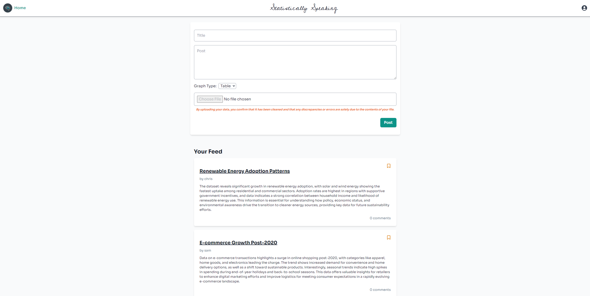

# Statstically Speaking

Statistically Speaking is a social media platform designed for data analysts, data scientists, and anyone passionate
about data and graphs. Users can create, share, and explore posts filled with visualizations, analyses, and datasets.
Built with React and Flask, Statistically Speaking offers an interactive and collaborative environment for the data
community.



## Technologies Used

- **Frontend**: React with Vite for fast, modern frontend development.
- **State Management**: Redux for global state management.
- **Backend**: Flask for handling server-side logic and API requests.
- **ORM**: SQLAlchemy for robust and easy-to-use object-relational-mapping.
- **Database**: PostgreSQL for production and SQLite for development.
- **Graphing Library**: D3.js for dynamic graphs.
- **Data**: Pandas for data manipulation and analysis.

## Local Development & Usage

### Prerequisites

Ensure you have the following installed:

- Node.js (v18 or higher)
- npm (v9 or higher)
- Python (v3.9.4 or higher)
- PostgreSQL (v14 or higher)

### 1. **Clone the Repository**

```sh
git clone https://github.com/aileks/statistically-speaking.git
```

### 2. Install Frontend Dependencies

```sh
cd react-vite && npm i
```

### 3. Set Up Backend

At the root of the project:

```sh
cp .env.example .env
pipenv install -r requirements.txt
pipenv shell
flask db upgrade
flask seed all
```

**Note**: You will have to add your own S3 bucket credentials to the .env file with the following keys:

- `S3_BUCKET`
- `S3_SECRET`
- `S3_KEY`

## Running the Application

### 1. Set Up Database

At the root of the project:

```sh
pipenv run flask db upgrade
pipenv run flask seed all
```

### 2. Start the Backend Server

At the root of the project:

```sh
pipenv run flask run
```

### 3. Start the Frontend Server

```sh
cd react-vite && npm run dev
```

### 4. Access the Application

Visit `http://localhost:5173/` in your browser to start using Beatbox.
